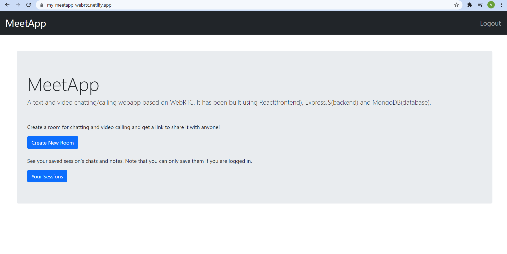

# MeetApp

## About The Project
As a part of **Microsoft Engage Mentorship Program 2021**, I have built a chatting and video calling  webapp using the WebRTC technology. 
My client-side consists of ReactJS, server-side is made with NodeJS along with sockets.io for socket connections and peerjs for RTCPeerConnections. I have used MongoDB as my database.

## Important Features
MeetApp allows you to -
* **Have chats and video calls with or without logging in.**
* **Generate a link and copy it for sharing with others.**
* **Give a name to any video call session.**
* **Chat with the members before the video call and continue it in the video call.**
* **Make any notes in the _Notebook_ section.**
* **Save any session's chats and notes to refer them back(only when logged in).**

## Deployment
Backend is hosted on **heroku** while frontend on **netlify**.

Link - [https://my-meetapp-webrtc.netlify.app](https://my-meetapp-webrtc.netlify.app)
